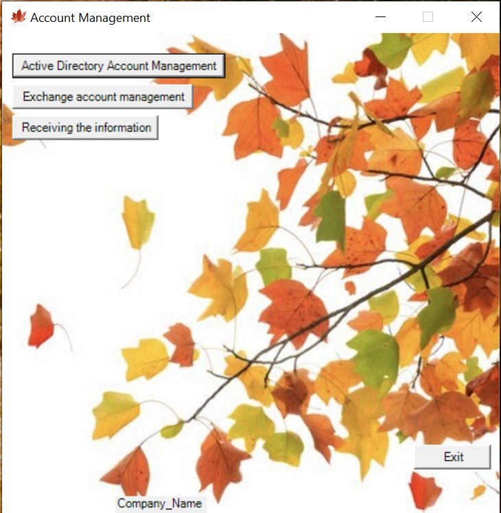

Функциональное интерактивное меню для возможности управления учетными записями Active Directory, Exchange и получение информации по необходимости.   
Работа разделена на два сервера в формате Клиент-Сервер -> Сервер для запуска [RemoteApp](https://learn.microsoft.com/ru-ru/windows-server/remote/remote-desktop-services/clients/windows) приложения и сервер [JEA](https://learn.microsoft.com/ru-ru/powershell/scripting/learn/remoting/jea/overview?view=powershell-7.3)

[Папка Client](https://github.com/AleksandrMikoshi/PowerShell/tree/main/Manage-Users/Client) располагается на сервере RemoteApp   
[Папка Server](https://github.com/AleksandrMikoshi/PowerShell/tree/main/Manage-Users/Server) располагается на сервере JEA

Для запуска приложения лучше использовать ключ тихого запуска:
```powershell.exe -windowstyle Hidden -file C:/Client/Start.ps1```




