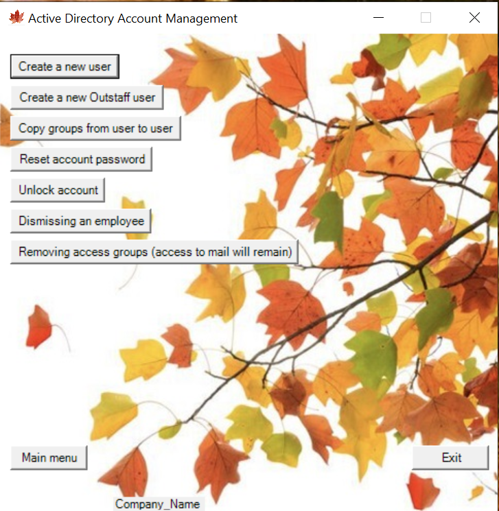

[Русский язык](https://github.com/AleksandrMikoshi/PowerShell/blob/main/Manage-Users/%20Readme_ru.md)

Functional interactive menu for the ability to manage Active Directory, Exchange accounts and obtain information as needed.   
The development is divided into two servers in the format Client-Server -> Server to run [RemoteApp](https://learn.microsoft.com/ru-ru/windows-server/remote/remote-desktop-services/clients/windows) applications and server [JEA](https://learn.microsoft.com/en-us/powershell/scripting/learn/remoting/jea/overview?view=powershell-7.3)   

The [Client folder](https://github.com/AleksandrMikoshi/PowerShell/tree/main/Manage-Users/Client) is located on the RemoteApp server   
The [Server folder](https://github.com/AleksandrMikoshi/PowerShell/tree/main/Manage-Users/Server) is located on the JEA server   

To start the application, it is better to use the silent start key:
```powershell.exe -windowstyle Hidden -file C:/Client/Start.ps1```


